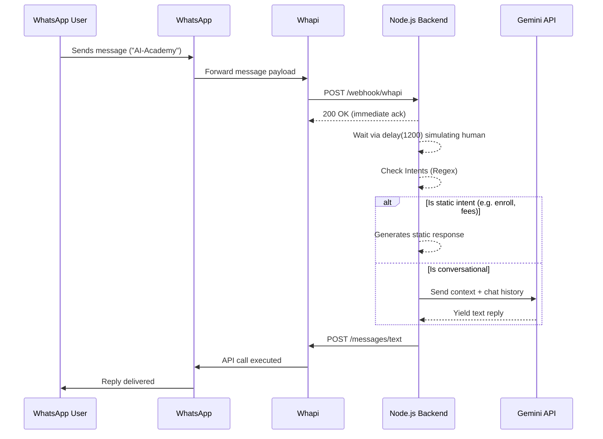

# AI Academy WhatsApp Chatbot - Low Level Design (LLD)

## 1. System Architecture & Scalability

The AI Academy WhatsApp chatbot is designed as an Express.js-based microservice that integrates the Whapi Cloud API and the Google Gemini API.

**Architecture Workflow:**
1. **Webhook Reception:** Whapi pushes inbound WhatsApp messages to the Express server via HTTP POST.
2. **Intent & State Management:** The Express server matches basic static keywords (like "fees" and "enroll"). For complex intents, it accesses the Gemini API.
3. **Session Store:** We keep an in-memory session (per-user map stringifying conversation history).
4. **Outbound Messaging:** Our service invokes the Whapi API using a REST `POST` request to send text to the destination WhatsApp user.

**Scalability Considerations:**
- Currently, sessions are tracked in-memory (`const sessions = {}`). If we scale this service horizontally behind a load balancer, memory-store (e.g., Redis) should be introduced for distributed session management.
- The webhook endpoint acknowledges incoming payload with a `status 200` immediately before deeply processing responses to prevent Whapi from incorrectly diagnosing a delivery failure.

## 2. Sequence Diagram

## 3. Security Considerations

- **`.env` Protection:** All secrets (Whapi token, Gemini keys) are stored via `.env` files and not committed to Source Control.
- **Webhook Obfuscation:** Using the `x-webhook-token` header validations logic (`WEBHOOK_TOKEN`) to prevent CSRF and malicious access to the webhook endpoint.
- **Input Validation:** Ensuring valid WhatsApp recipient numbers (e.g., checking if the recipient has `10-15 digits` or suffix `@s.whatsapp.net`).

## 4. Advanced Ban Avoidance Strategy

WhatsApp handles commercial automated traffic strictly. To help mitigate the risk of our sender number receiving a ban:
1. **The 1.2s Artificial Delay:** A hardcoded `delay(1200 + Math.random() * 500)` guarantees that the bot cannot reply inhumanely fast, lowering the spam coefficient scoring by WhatsApp Meta servers.
2. **Opt-in Priority:** Bots should never initiate cold contact. This chatbot is engineered strictly to reply to inbound webhook calls.
3. **Keyword Bypasses:** Bypassing the LLM on static keywords (e.g. fees, register) ensures accurate, standard-compliant boilerplate messaging that matches verified human standards.
4. **Controlled Prompt Outputs:** Giving the Gemini context rules limiting to `< 3 sentences` prevents huge paragraphs of spam-like text.
